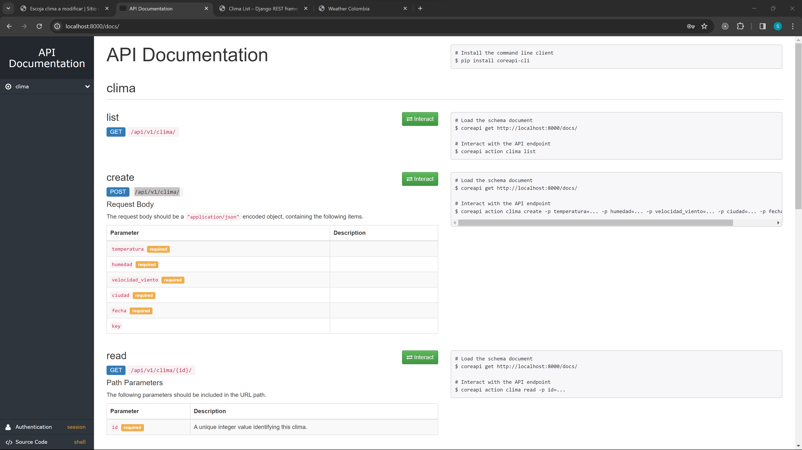
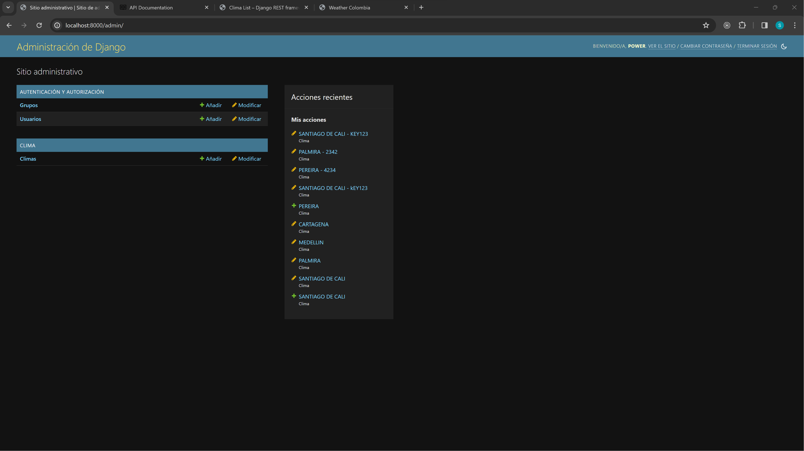
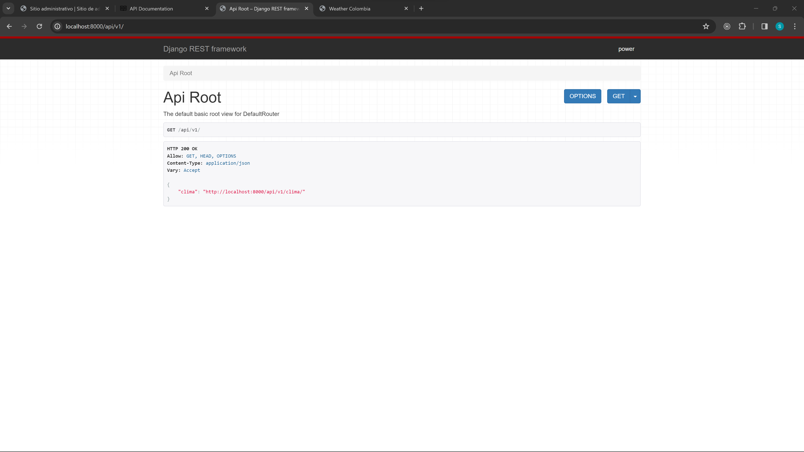
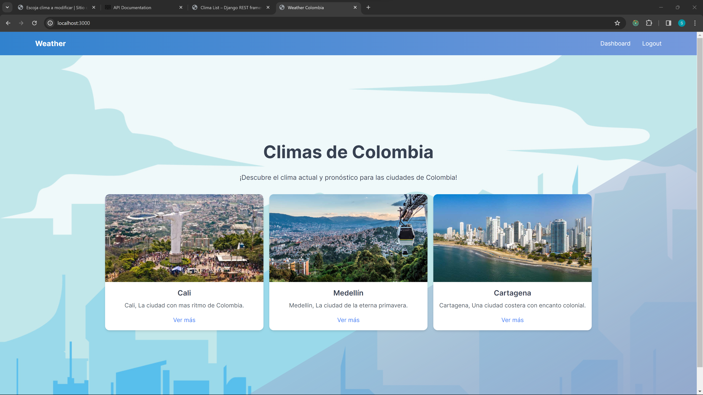
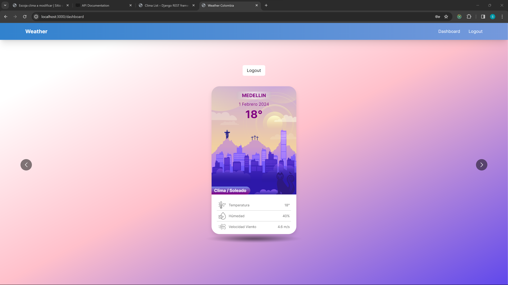
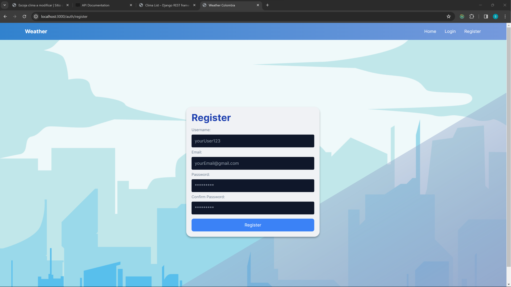
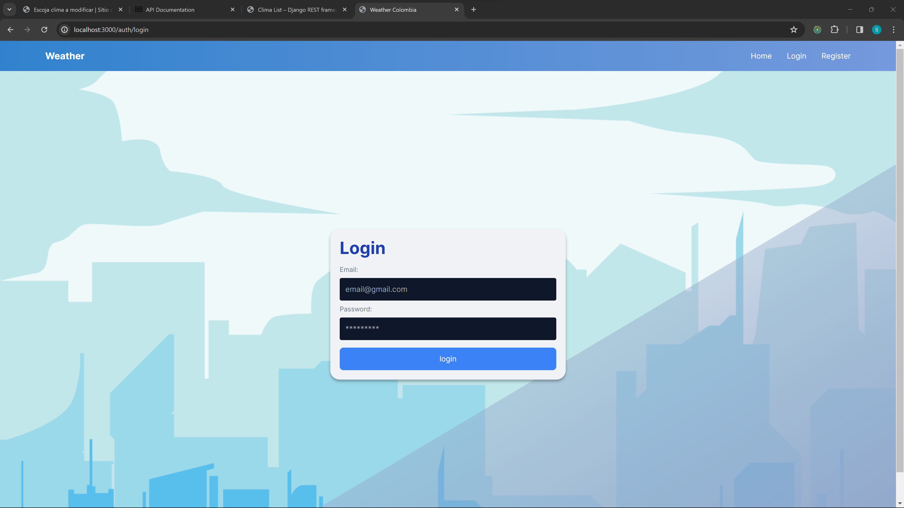

# API de Datos Climáticos de Colombia

Este proyecto es una API que proporciona datos simulados del clima para diferentes ciudades de Colombia.

## Instalación Backend

Para utilizar esta API, sigue estos pasos:

1. Clona este repositorio en tu máquina local:

```bash
git clone https://github.com/sebastiangnw/talentum.git
```

2. Crea un entorno virtual en la carpeta `backend` para aislar las dependencias de tu proyecto:

```python
cd talentum/backend
python -m venv venv
```

3. Activa el entorno virtual:

En Windows:

```python
venv\Scripts\activate
```

En macOS y Linux:

```python
source venv/bin/activate
```

4. Instala las dependencias necesarias utilizando pip:

```python
pip install -r requirements.txt
```

5. Crear archivo .env

Este proyecto utiliza una base de datos PostgreSQL. Antes de realizar las migraciones de la base de datos, asegúrate de crear un archivo `.env`
en la raíz del proyecto `backend` para almacenar las variables de entorno necesarias. A continuación, muestra un ejemplo de cómo debería ser el archivo `.env`:

`nextauthdb` es el nombre de la tabla de postgresql

```python
SECRET_KEY=token_ramdon
DEBUG=True
DB_NAME=nextauthdb
DB_USER=postgres
DB_PASSWORD=clave
DB_HOST=localhost
ALLOWED_HOSTS=127.0.0.1, localhost
```

6. Cambio de base de datos a SQLite

Si prefieres utilizar SQLite en lugar de PostgreSQL, puedes hacerlo modificando el archivo `settings.py`. A continuación, se muestra cómo puedes realizar este cambio:

Abre el archivo `settings.py` en tu proyecto Django.

Busca la configuración de la base de datos. Debería verse algo así:

```python
DATABASES = {
    'default': {
        'ENGINE': 'django.db.backends.postgresql_psycopg2',
        "NAME": config("DB_NAME"),
        "USER": config("DB_USER"),
        "PASSWORD": config("DB_PASSWORD"),
        "HOST": config("DB_HOST"),
    }
}
```

Cambia el motor de la base de datos de PostgreSQL a SQLite. La configuración debe quedar así:

```python
DATABASES = {
    'default': {
        'ENGINE': 'django.db.backends.sqlite3',
        'NAME': BASE_DIR / 'db.sqlite3',
    }
}
```

7. Realiza las migraciones de la base de datos:

Asegúrate de tener configurado correctamente el punto anterior antes de realizar las migraciones de la base de datos.

```python
python manage.py makemigrations
python manage.py migrate
```

8. Recuerda crear un usuario para poder acceder al admin

```python
python manage.py createsuperuser
```

9. Inicia el servidor de desarrollo:

```python
python manage.py runserver
```







## Uso

Puedes acceder a los datos climáticos utilizando las siguientes rutas:

- `/docs`: Documentación de la API generada automáticamente.
- `/api/v1/clima/`: Obtiene una lista de todas las ciudades disponibles con sus datos climáticos.
- `/api/v1/clima/{id}/`: Obtiene los datos climáticos específicos de la ciudad especificada.
- **Nota:** Agrega `/?key=123` (no importa el valor, lo importante es que exista) al final de la URL para acceder al recurso.

Ejemplo:

- localhost:800/api/v1/clima/?key=123
- localhost:800/api/v1/clima/{id}/?key=1433a

### Ejemplo de JSON para el método POST

- temperatura: String
- humedad: String
- velocidad_viento: Float
- ciudad: String
- fecha: String
- key: String

```json
{
    "temperatura": "",
    "humedad": "",
    "velocidad_viento": ,
    "ciudad": "",
    "fecha": "",
    "key": ""
}
```

El key del modelo (No confundir con el key de la URL) permite que los datos aparezcan en las consultas, por ejemplo, si se tienen dos campos en la base de datos, donde uno tiene key y otro no,
la peticiones solo mostraran los campos con key, en este ejemplo, la peticion GET solo visualizaria los valores de CARTAGENA

```json
{
    "id": 1,
    "temperatura": "25",
    "humedad": "80",
    "velocidad_viento": 6.5,
    "ciudad": "CARTAGENA",
    "fecha": "11 Febrero 2024",
    "key": "KEY1456"
}
{
    "id": 2,
    "temperatura": "35",
    "humedad": "50",
    "velocidad_viento": 2.5,
    "ciudad": "SANTIAGO DE CALI",
    "fecha": "12 Febrero 2024",
    "key":
}
```

## Instalación Frontend

Este proyecto utiliza Next.js para el frontend, y Prisma para crear el backend del usuario, con la misma base de datos PostgreSQL, puedes cambiarla si gustas en el archivo `schema.prisma` dentro de la carpeta `frontend/prisma`.

1. Asegúrate de tener Node.js y npm instalado en tu máquina. (Las versiones usadas en este proyecto son Node v20.11.0 y npm v10.4.0)

2. Abre una terminal y navega hasta la carpeta `frontend` en tu proyecto.

3. Instala las dependencias del proyecto ejecutando el siguiente comando:

```bash
npm install
```

4. Realiza la migración de Prisma, ejecutando:

```bash
npx prisma migrate dev --name init
```

5. Una vez que se hayan instalado todas las dependencias, puedes iniciar el servidor de desarrollo ejecutando:

```bash
npm run dev
```



6. Recuerda crear un usuario en la vista `register` y luego acceder en `login`, para poder acceder al dashboard







Esto iniciará el servidor de desarrollo de Next.js. Puedes acceder a tu aplicación en http://localhost:3000 en tu navegador web.

7. Si necesitas compilar tu aplicación para producción, puedes hacerlo ejecutando:

```bash
npm run build
```

8. Y luego iniciar el servidor en modo de producción con:

```bash
npm run start
```

¡Y eso es todo! Ahora deberías tener tu aplicación Next.js funcionando localmente en tu máquina. Si necesitas más ayuda, no dudes en preguntar.

## Contribución

¡Siéntete libre de contribuir a este proyecto! Puedes presentar problemas, enviar solicitudes de extracción y ayudar a mejorar la API.

## Licencia

Este proyecto está licenciado bajo una Licencia de Uso Libre. Puedes utilizarlo, modificarlo y distribuirlo libremente. Consulta el archivo LICENSE para obtener más detalles.
